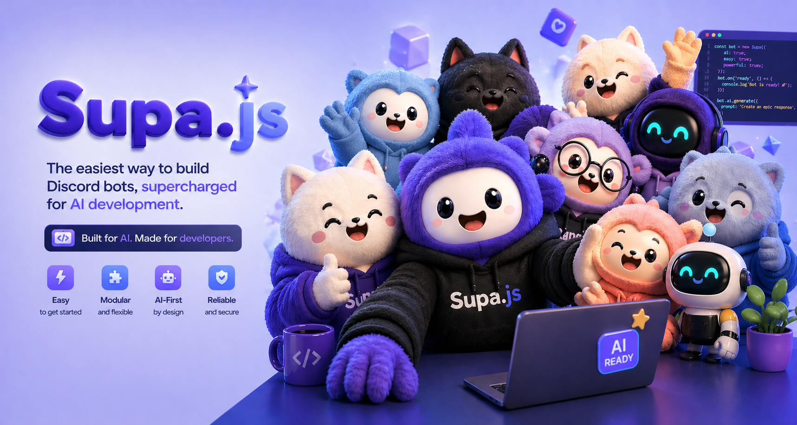
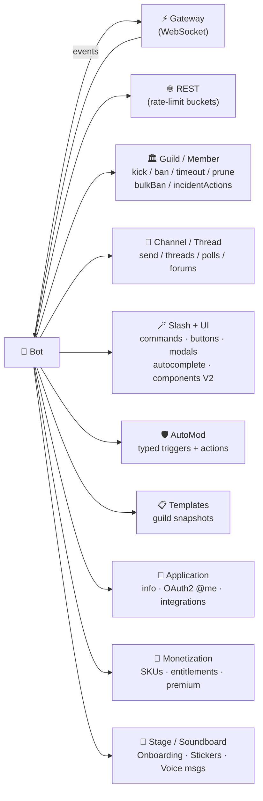

<p align="center">
  
</p>

<h1 align="center">Supa.js</h1>

<p align="center">
  <b>Tiny, LLM-friendly Discord bot library.</b><br/>
  Ringkas, sat-set, no fluff.
</p>

<p align="center">
  <a href="#install"></a>
  
  
  
  
  
</p>

<p align="center">
  Built from scratch on top of Discord's Gateway + REST. <b>Zero runtime
  dependencies</b> — only Node 22's built-in <code>WebSocket</code> and
  <code>fetch</code>.
</p>

<p align="center">
  Functional parity with <code>discord.js</code> for nearly every common bot
  task — but with a flat, predictable, object-literal-everywhere API that an
  LLM can generate first try.
</p>

---

## Why Supa.js?

`discord.js` is huge, ceremony-heavy, and forces you through builder classes
and managers. Supa.js follows a few hard rules:

| | Rule | What it looks like |
|---|---|---|
| 1 | **One class.** | `Bot`. Everything hangs off it. |
| 2 | **Methods on the thing.** | `member.kick()`, `msg.reply()`, `ctx.update()` — never `client.guilds.cache.get(id).members.fetch(...).kick()`. |
| 3 | **Object literals, not builders.** | Embeds are `{ title, description }`. Buttons are `button({ customId, label, style })`. No `.setX().setY()` chains. |
| 4 | **Auto-deploy.** | Registered commands ship on `start()`. No separate register script. |
| 5 | **Silent mentions by default.** | Replies don't ping unless you ask. |
| 6 | **Zero deps.** | Just Node 22+. |

> Compared with discord.js, that's roughly **60% fewer lines** for the same
> behaviour, no register script, no enum imports, no type guards, and no
> @everyone footgun.

---

## What's covered



<div align="center">

| 🪄 **Interactions** | 🛡️ **Moderation** | 🏛️ **Guild Admin** |
|---|---|---|
| Slash + sub/group | bulkBan / fetchBan / unban | Templates CRUD |
| User & Message commands | timeout / kick | Integrations + events |
| Buttons / selects / modals | prune (preview + execute) | Audit log |
| Autocomplete | incident actions (lockdown) | Onboarding · Welcome screen |
| Components V2 | AutoMod (typed helpers) | Widget · Scheduled events |
| Localizations (33 locales) | Per-route rate-limits | Search guild messages |

| 💬 **Channels** | 💎 **Monetization** | 🎤 **Voice / Misc** |
|---|---|---|
| Text · voice · forum · media | SKUs / entitlements | Stage instances |
| Threads · polls | Premium-style buttons | Soundboard |
| Webhooks · invites | Role-connection metadata | Voice messages |
| Crosspost · forward · follow | App emojis | Stickers + packs |

</div>

---

## ✨ What's new in `0.2` (2026-04)

This release closes the remaining gaps from `TODO.md`:

- 🛡️ **Bulk ban** — `guild.bulkBan({ userIds, deleteMessageSeconds?, reason? })` (up to 200 users / call)
- 🛡️ **Single-ban lookup** — `guild.fetchBan(userId)` returns `null` if not banned (no `10026` throw)
- 🧹 **Prune** — `guild.getPruneCount({...})` (dry-run) and `guild.beginPrune({...})`
- 🚨 **Incident actions** — `guild.setIncidentActions({ invitesDisabledUntil, dmsDisabledUntil })` for raid lockdown
- 📋 **Guild Templates** — full CRUD: `bot.templates.fetch / createGuild`, `guild.templates.list / create / sync / edit / delete`
- 🔌 **Integrations** — `guild.fetchIntegrations()`, `guild.deleteIntegration(id)`, gateway events `integrationCreate` / `Update` / `Delete`
- 🔑 **App / OAuth** — `bot.fetchApplication()`, `bot.editApplication({...})`, `bot.fetchOwnAuthorization(bearerToken)`
- 🌐 **Localizations** — typed `localize: { name, description }` on every `CommandDef` / option / choice. 33 locales, runtime validation, autoconverts to Discord's `*_localizations`
- 🤖 **AutoMod helpers** — object-literal `AutoModTrigger.{keyword,spam,keywordPreset,mentionSpam,memberProfile}` and `AutoModAction.{block,alert,timeout}` so you can spread them into `guild.automod.create(...)`
- 🩺 **DiscordErrorCodes** expanded **30 → 110+** curated entries with `kind / name / meaning / fix`. New `discordErrorCodesToJSON()` for AI tooling.
- 📚 New end-to-end demo: [`examples/admin-2026.ts`](./examples/admin-2026.ts) (`npm run example:admin`)

> Full changelog & implementation status: [`PROGRESS.md`](./PROGRESS.md) · [`TODO.md`](./TODO.md)

---

## 🚧 In progress / roadmap

What's **next** vs. what's **explicitly out of scope**:

| Status | Item | Notes |
|---|---|---|
| 🔭 watch | Discord changelog (monthly) | tracked against [docs.discord.com/developers/docs/changelog](https://docs.discord.com/developers/docs/changelog), [llms.txt](https://docs.discord.com/llms.txt), [api-docs commits](https://github.com/discord/discord-api-docs/commits/main) |
| 🔍 verify | Attachment `title` / `description` post-upload edits | mentioned in api-docs PR #7353 — needs spec confirmation if `PATCH` exposed for bots |
| 🔍 verify | Forwarded message `editedTimestamp` nullable semantics | currently raw pass-through |
| 🔍 verify | New Components V2 layouts after 2026-04 | re-check on next changelog review |
| 🤝 wishlist | Test runner / unit tests | currently relies on TS strict + smoke examples |
| 🤝 wishlist | CI workflow | repo has none yet — minimal would be `node 22 → typecheck → build` |
| ⛔ out of scope | **Voice send/receive** (UDP + Opus + libsodium) | ~2k LOC + native deps. Use a separate library; Supa.js exposes `voiceStateUpdate` / `voiceServerUpdate` so a voice lib can attach |
| ⛔ out of scope | **Discord Social SDK / RPC-over-IPC** | not a bot concern |
| ⛔ out of scope | `GET /users/@me/channels` | user-token only |
| ⛔ out of scope | `GET /channels/{id}/followers` | Discord doesn't expose for bots; only `POST .../followers` exists (already implemented as `channel.follow()`) |
| ⛔ out of scope | Activity Instance handshake | Activities SDK, not a bot endpoint |

---

## Install

```bash
npm install supa.js
```

Requires **Node.js >= 22**.

---

## ⚡ 30-second example

```ts
import { Bot } from "supa.js";

const bot = new Bot(process.env.DISCORD_TOKEN!);

bot.on("ready", (me) => console.log("logged in as", me.name));
bot.on("message", (m) => m.content === "!ping" && m.reply("pong"));

bot.command("hello", { description: "Say hi" },
  (ctx) => ctx.reply(`hi ${ctx.user.name}`),
);

await bot.start();
```

Compared with discord.js, that's about **60% fewer lines** for the same
behaviour, no register script, no enum imports, no type guards, and no
@everyone footgun.

---

## 📒 Cheatsheet

> 📚 Quick links: [What's new (0.2)](#-whats-new-in-02-2026-04) ·
> [Roadmap](#-in-progress--roadmap) ·
> [PROGRESS.md](./PROGRESS.md) · [TODO.md](./TODO.md) ·
> [Examples](./examples/)

> Skip to a section: [Bot](#-bot) · [Events](#-events) · [Slash commands](#-slash-commands) ·
> [Subcommands](#-subcommands--groups) · [User/Message commands](#%EF%B8%8F-context-menu-commands) ·
> [Buttons & selects](#-buttons--selects) · [Modals](#-modals) ·
> [Autocomplete](#-autocomplete) · [Embeds](#%EF%B8%8F-embeds) · [Files](#-file-attachments) ·
> [Messages](#-message-actions) · [Channels](#-channels--threads) ·
> [Members & guilds](#%EF%B8%8F-members--guilds) · [Roles](#-roles) ·
> [Webhooks](#-webhooks) · [Invites](#-invites) · [Permissions](#-permissions) ·
> [Collectors](#-collectors) · [Cache](#-cache) · [Sharding](#%EF%B8%8F-sharding) ·
> [Auto-mod](#%EF%B8%8F-auto-mod) · [Components V2](#-components-v2-2025--rich-layouts-without-embeds) ·
> [Monetization](#-monetization--skus-entitlements-premium-buttons) ·
> [Errors (AI-friendly)](#-structured-error-messages-ai-friendly) ·
> [REST escape hatch](#-escape-hatch--raw-rest)

### 🤖 Bot

```ts
new Bot(token, opts?)            // opts: intents, apiUrl, gatewayUrl, shard, cache, presence
bot.on(event, handler) | bot.once(event, handler) | bot.off(event, handler)
bot.command(name, def, handler)
bot.userCommand(name, def, handler)
bot.messageCommand(name, def, handler)
bot.button(customId | RegExp, handler)
bot.select(customId | RegExp, handler)
bot.modal(customId | RegExp, handler)
bot.autocomplete("cmd:opt" | "cmd.sub:opt", handler)
bot.fetchUser(id) | bot.fetchGuild(id) | bot.fetchChannel(id)
bot.setPresence({ status, activities })
await bot.start()                // connect + auto-deploy commands
bot.stop()
bot.me                           // User after `ready`
bot.applicationId                // string after `ready`
```

### 📡 Events

| event                       | payload                                                            |
| --------------------------- | ------------------------------------------------------------------ |
| `ready`                     | `me: User`                                                         |
| `resumed`                   | —                                                                  |
| `message`                   | `msg: Message` (bot/self filtered)                                 |
| `messageUpdate`             | `msg: Message`                                                     |
| `messageDelete`             | `{ id, channelId, guildId? }`                                      |
| `messageDeleteBulk`         | `{ ids, channelId, guildId? }`                                     |
| `messageReactionAdd`        | `{ messageId, channelId, userId, emoji, … }`                       |
| `messageReactionRemove`     | same shape                                                         |
| `messageReactionRemoveAll`  | `{ messageId, channelId }`                                         |
| `interaction`               | any `Ctx` (also auto-routed to handlers)                           |
| `guildCreate/Update/Delete` | `Guild` / `Guild` / `{ id, unavailable? }`                         |
| `guildMemberAdd/Update`     | `GuildMember`                                                      |
| `guildMemberRemove`         | `{ user, guildId }`                                                |
| `channelCreate/Update/Delete` | `Channel`                                                        |
| `channelPinsUpdate`         | `{ channelId, guildId?, lastPinTimestamp? }`                       |
| `threadCreate/Update`       | `Channel`                                                          |
| `threadDelete`              | `{ id, channelId, guildId, type }`                                 |
| `roleCreate/Update`         | `Role`                                                             |
| `roleDelete`                | `{ roleId, guildId }`                                              |
| `typingStart`               | `{ channelId, userId, … }`                                         |
| `presenceUpdate`            | raw presence payload                                               |
| `voiceStateUpdate`          | raw voice state                                                    |
| `inviteCreate/Delete`       | `{ code, channelId, guildId? }`                                    |
| `error`                     | `unknown`                                                          |
| `close`                     | `{ code, reason }`                                                 |
| `raw`                       | `(eventName, data)` — any unwrapped event                          |

### 🪄 Slash commands

```ts
bot.command(
  "echo",
  {
    description: "Echo what you said",
    guildId: process.env.GUILD_ID,        // optional, instant deploy in dev
    options: [
      { name: "text", description: "what to echo",
        type: "String", required: true, maxLength: 200 },
    ],
  },
  (ctx) => ctx.reply(ctx.optString("text")!),
);
```

`ctx` is a `ChatInputCtx`:
```ts
ctx.commandName; ctx.fullPath  // "settings.notifications.toggle"
ctx.user; ctx.member; ctx.guildId; ctx.channelId
ctx.opt<T>(name)
ctx.optString(name) | optInt | optBool
ctx.optUser(name)         // -> User | undefined
ctx.optMember(name)       // -> GuildMember | null
ctx.optChannelId(name)    // -> string | undefined
ctx.optRoleId(name)
ctx.optAttachment(name)   // -> { id, url, filename, size }

await ctx.reply(text | { content, embeds, components, ephemeral, files, … })
await ctx.defer({ ephemeral? })
await ctx.editReply(text | opts)
await ctx.deleteReply()
await ctx.followup(text | opts)
await ctx.showModal({ customId, title, inputs })
```

Option types accept strings (`"String"`, `"Integer"`, `"Boolean"`, `"User"`,
`"Channel"`, `"Role"`, `"Mentionable"`, `"Number"`, `"Attachment"`) or
numeric `OptionType.*`.

#### Localizations (per-locale name/description)

Pass a typed `localize` table on the command, options, and choices:

```ts
import { Locale } from "supa.js";   // optional — runtime is just strings

bot.command(
  "hello",
  {
    description: "Say hi",
    localize: {
      name: { id: "halo", "es-ES": "hola", fr: "salut" },
      description: { id: "Sapa seseorang", "es-ES": "Saluda a alguien" },
    },
    options: [
      {
        name: "lang",
        description: "Pick a language",
        type: "String",
        localize: {
          name: { id: "bahasa" },
          description: { id: "Pilih bahasa" },
        },
        choices: [
          { name: "English", value: "en", nameLocalizations: { id: "Inggris" } },
          { name: "Indonesian", value: "id", nameLocalizations: { id: "Indonesia" } },
        ],
      },
    ],
  },
  async (ctx) => ctx.reply(ctx.optString("lang") === "id" ? "Halo!" : "Hello!"),
);
```

Locale codes are validated at compile time against Discord's supported
`Locale` union (`id`, `da`, `de`, `en-GB`, `en-US`, `es-ES`, `es-419`, `fr`,
`hr`, `it`, `lt`, `hu`, `nl`, `no`, `pl`, `pt-BR`, `ro`, `fi`, `sv-SE`, `vi`,
`tr`, `cs`, `el`, `bg`, `ru`, `uk`, `hi`, `th`, `zh-CN`, `ja`, `zh-TW`, `ko`).
Use `validateLocaleTable(table, "name")` for runtime validation.

### 🌳 Subcommands & groups

Use **dotted names**:

```ts
bot.command("fruit.pick", { description: "Pick a fruit", options: [...] }, ...)
bot.command("fruit.list", { description: "List fruits" }, ...)
bot.command("admin.user.ban", { description: "Ban", options: [...] }, ...)  // group + sub
```

Supa.js builds the option tree under the parent automatically.

### 🖱️ Context-menu commands

```ts
bot.userCommand("Get Avatar", { guildId }, (ctx) =>
  ctx.reply({ content: ctx.target.avatarUrl(512), ephemeral: true }),
);

bot.messageCommand("Save", { guildId }, (ctx) =>
  ctx.reply(`Saved ${ctx.target.url}`),
);
```

### 🔘 Buttons & selects

```ts
import { row, button, linkButton, stringSelect } from "supa.js";

await ctx.reply({
  content: "Pick one:",
  components: [
    row(
      button({ customId: "vote:yes", label: "Yes", style: "success", emoji: "✅" }),
      button({ customId: "vote:no",  label: "No",  style: "danger",  emoji: "❌" }),
      linkButton({ url: "https://example.com", label: "Docs" }),
    ),
    row(stringSelect({
      customId: "lang",
      placeholder: "Pick a language",
      options: [{ label: "TypeScript", value: "ts" }, { label: "Python", value: "py" }],
    })),
  ],
});

bot.button("vote:yes", (ctx) => ctx.update({ content: "✅ voted yes" }));
bot.button(/^vote:/,    (ctx) => ctx.reply({ content: `voted: ${ctx.customId}`, ephemeral: true }));
bot.select("lang",      (ctx) => ctx.update({ content: `chose ${ctx.values[0]}` }));
```

`ComponentCtx`:
```ts
ctx.customId; ctx.values; ctx.message
await ctx.update(opts)        // edit the original message
await ctx.deferUpdate()
await ctx.reply(opts) | ctx.followup(opts)  // send a separate response
```

Other selects: `userSelect`, `roleSelect`, `mentionableSelect`,
`channelSelect({ channelTypes: [...] })`.

### 🧾 Modals

```ts
import { textInput } from "supa.js";

bot.command("feedback", { description: "Send feedback" }, (ctx) =>
  ctx.showModal({
    customId: "feedback:form",
    title: "Send feedback",
    inputs: [
      textInput({ customId: "title", label: "Title", style: "short", required: true }),
      textInput({ customId: "body",  label: "Body",  style: "paragraph", maxLength: 2000 }),
    ],
  }),
);

bot.modal("feedback:form", (ctx) =>
  ctx.reply(`got: **${ctx.field("title")}**\n${ctx.field("body")}`),
);
```

### 🔮 Autocomplete

```ts
bot.command("fruit.pick", { description: "Pick a fruit",
  options: [{ name: "name", description: "fruit", type: "String", required: true, autocomplete: true }],
}, (ctx) => ctx.reply(`you picked ${ctx.optString("name")}`));

bot.autocomplete("fruit.pick:name", (ctx) => {
  const q = ctx.focused.value.toLowerCase();
  return ctx.respond(FRUITS.filter(f => f.startsWith(q)).map(f => ({ name: f, value: f })));
});
```

### 🖼️ Embeds

Just an object:

```ts
await ctx.reply({
  embeds: [{
    title: "Status",
    description: "All good.",
    color: 0x57f287,
    fields: [{ name: "API", value: "✅ 42ms", inline: true }],
    footer: { text: "Supa.js" },
    timestamp: new Date().toISOString(),
  }],
});
```

### 📎 File attachments

```ts
await ctx.reply({
  content: "Here's a file:",
  files: [{ name: "report.txt", data: Buffer.from("hi"), type: "text/plain" }],
});
```

`data` accepts `Uint8Array | Buffer | string`. Multipart upload is handled
automatically.

### 💬 Message actions

```ts
m.id; m.channelId; m.guildId; m.content; m.author  // User
m.attachments; m.embeds; m.components; m.reactions
m.url                              // jump-to-message link
await m.reply(text | opts)         // pingReplyTarget: false (default)
await m.send(opts)
await m.edit(text | opts)
await m.delete(reason?)
await m.pin() | m.unpin()
await m.react("👍")
await m.removeMyReaction("👍")
await m.removeReaction("👍", userId)
await m.clearReactions(emoji?)
await m.fetchReactionUsers(emoji)
await m.startThread({ name, autoArchiveDuration? })
await m.crosspost()
m.raw                              // escape hatch
```

### 🧵 Channels & threads

```ts
const ch = await bot.fetchChannel(id)
ch.id; ch.type; ch.guildId; ch.name; ch.mention
ch.isText() | ch.isVoice() | ch.isThread()
await ch.send(text | opts)
await ch.fetchMessages({ limit?, before?, after?, around? })
await ch.fetchMessage(id)
await ch.bulkDelete(ids[], reason?)
await ch.typing()
await ch.edit({ name?, topic?, ... }, reason?)
await ch.delete(reason?)
await ch.createThread({ name, autoArchiveDuration?, fromMessage? })
await ch.fetchActiveThreads()
await ch.setArchived(true) | ch.setLocked(true)
await ch.addThreadMember(userId) | removeThreadMember | joinThread | leaveThread
await ch.createInvite({ maxAge?, maxUses?, temporary?, unique? })
await ch.fetchInvites()
await ch.createWebhook({ name, avatar? })
await ch.fetchWebhooks()
await ch.setPermission(targetId, { allow?, deny?, type: "role"|"member" })
await ch.fetchPinned()
```

### 🏛️ Members & guilds

```ts
const g = await bot.fetchGuild(id)
g.fetchMember(userId) | g.fetchMembers({ limit?, after? })
g.searchMembers(query, limit?)
g.ban(userId, { reason?, deleteMessageSeconds? })
g.unban(userId, reason?) | g.kick(userId, reason?)
g.fetchBans({ limit?, before?, after? })
g.fetchBan(userId)                                    // null if not banned (no 10026)
g.bulkBan({ userIds, deleteMessageSeconds?, reason? })// up to 200 users / call
g.getPruneCount({ days?, includeRoleIds? })           // dry-run prune
g.beginPrune({ days?, computePruneCount?, includeRoleIds?, reason? })
g.setIncidentActions({ invitesDisabledUntil?, dmsDisabledUntil?, reason? })
g.fetchRoles() | g.createRole({ name?, color?, permissions?, ... })
g.fetchChannels() | g.createChannel({ name, type?, ... })
g.fetchInvites() | g.fetchWebhooks()
g.fetchIntegrations() | g.deleteIntegration(id, reason?)
g.fetchAuditLog({ userId?, actionType?, limit? })
g.fetchScheduledEvents() | g.createScheduledEvent({...})
g.templates.list() | g.templates.create({ name, description? })
g.templates.sync(code) | g.templates.edit(code, {...}) | g.templates.delete(code)
g.edit({ name?, description?, icon? }) | g.leave()

// Top-level templates (no guildId required):
bot.templates.fetch(code)                     // GET /guilds/templates/{code}
bot.templates.createGuild(code, { name, icon? })

// Application info / OAuth:
bot.fetchApplication()                        // GET /applications/@me
bot.editApplication({ description?, icon?, coverImage?, flags?, tags?, ... })
bot.fetchOwnAuthorization(bearerToken)        // GET /oauth2/@me

// On a member:
member.user; member.name; member.nick; member.roleIds; member.joinedAt
await member.kick(reason?) | member.ban({ reason?, deleteMessageSeconds? })
await member.timeout(seconds, reason?)              // 0 = remove timeout
await member.edit({ nick?, roles?, mute?, deaf?, channelId? })
await member.addRole(roleId, reason?) | member.removeRole(roleId)
await member.send(text | opts)                      // DM
```

### 🎭 Roles

```ts
role.id; role.name; role.color; role.position; role.permissions; role.mention
await role.edit({ name?, color?, permissions?, mentionable? })
await role.delete(reason?)
```

### 🪝 Webhooks

```ts
const wh = await ch.createWebhook({ name: "Logs" })
await wh.send("hi")  // or { content, embeds, username, avatar_url }
await wh.edit({ name, avatar })
await wh.delete()
```

### 🔗 Invites

```ts
const inv = await ch.createInvite({ maxAge: 0, maxUses: 0, unique: true })
inv.code; inv.url; inv.uses; inv.maxUses; inv.expiresAt
await inv.delete()
```

### 🔐 Permissions

```ts
import { Permissions } from "supa.js";

const bits = Permissions.build("ManageMessages", "BanMembers");
Permissions.has(bits, "ManageMessages")  // true
Permissions.has(member.raw.permissions, "Administrator")
Permissions.list(bits)  // ["BanMembers","ManageMessages"]
```

### 🪤 Collectors

```ts
import { collect, await_ } from "supa.js";

// Wait for the next reply in a channel from a specific user:
const msg = await await_.message(bot, {
  filter: (m) => m.channelId === ch.id && m.author.id === userId,
  timeout: 30_000,
});

// Wait for up to 5 button clicks in 1 minute:
const clicks = await collect.component(bot, {
  filter: (c) => c.customId.startsWith("vote:"),
  max: 5,
  timeout: 60_000,
});
```

### 💾 Cache

Off by default. Enable for a low-effort in-memory cache:

```ts
const bot = new Bot(token, { cache: true });
// or:
bot.cache.enable({ users: 10_000, members: 10_000, messages: 5_000 });

bot.cache.users.get(id)
bot.cache.members.get(`${guildId}:${userId}`)
bot.cache.guilds.get(id)
bot.cache.channels.get(id)
```

### ✂️ Sharding

```ts
import { Bot, ShardManager } from "supa.js";

const sm = new ShardManager({
  token: process.env.DISCORD_TOKEN!,
  total: "auto",
  factory: (id, total, opts) => new Bot(process.env.DISCORD_TOKEN!, opts),
});
await sm.spawn();
```

### 🧱 Components V2 (2025) — rich layouts without embeds

Components V2 lets you compose messages from layout primitives. Pass
`componentsV2: true` and Supa.js will set the right flag for you (V2 messages
cannot also have `content`/`embeds`/`stickers`).

```ts
import { container, section, textDisplay, separator, mediaGallery, button, row } from "supa.js";

await ch.send({
  componentsV2: true,
  components: [
    container({
      accentColor: 0x5865f2,
      children: [
        textDisplay("# Headline"),
        textDisplay("Body markdown."),
        separator({ divider: true, spacing: "small" }),
        section({
          text: ["**Section**", "Body alongside an accessory."],
          accessory: button({ customId: "x", label: "Click", style: "primary" }),
        }),
        mediaGallery([{ url: "https://...", description: "image" }]),
        row(button({ customId: "y", label: "Next", style: "primary" })),
      ],
    }),
  ],
});
```

Components: `textDisplay`, `separator`, `section`, `thumbnail`, `mediaGallery`,
`fileComponent`, `container`, plus the existing `row`/`button`/select helpers.

### 📊 Polls

```ts
await ch.send({
  poll: {
    question: "Pizza or burger?",
    answers: ["🍕 Pizza", "🍔 Burger"],
    durationHours: 24,
    allowMultiselect: false,
  },
});

bot.on("pollVoteAdd",   ({ messageId, userId, answerId }) => { /* ... */ });
bot.on("pollVoteRemove", info => { /* ... */ });

await ch.expirePoll(messageId);
const voters = await ch.fetchPollVoters(messageId, /*answerId*/ 1);
```

### 🛡️ Auto-mod

```ts
import { AutoModTrigger, AutoModAction } from "supa.js";

const rule = await bot.automod(guildId).create({
  name: "Block: bad-word",
  ...AutoModTrigger.keyword({ keywords: ["badword"], regex: ["b[a4]dword"] }),
  actions: [
    AutoModAction.block({ customMessage: "Blocked." }),
    AutoModAction.timeout(5 * 60),
  ],
});
await bot.automod(guildId).list();
await bot.automod(guildId).edit(rule.id, { enabled: false });
await bot.automod(guildId).delete(rule.id);

bot.on("autoModActionExecute", info => {
  console.log(`fired by ${info.userId}: ${info.matchedKeyword}`);
});
```

Typed helpers:
- `AutoModTrigger.keyword({ keywords?, regex?, allowList? })`
- `AutoModTrigger.spam()`
- `AutoModTrigger.keywordPreset({ presets, allowList? })` — `"Profanity" | "SexualContent" | "Slurs"`
- `AutoModTrigger.mentionSpam({ total, raidProtection? })`
- `AutoModTrigger.memberProfile({ keywords?, regex?, allowList? })`
- `AutoModAction.block({ customMessage? })`
- `AutoModAction.alert(channelId)`
- `AutoModAction.timeout(seconds)`

The raw `triggerType` + `triggerMetadata` shape still works if you prefer it.

### 😊 Application emojis (no guild needed)

```ts
const created = await bot.emojis.create({
  name: "supa",
  image: fs.readFileSync("supa.png"),    // Buffer or Uint8Array
});
console.log(created.toString());          // "<:supa:123>"
await bot.emojis.list();
await bot.emojis.delete(created.id);
```

### 🎙️ Voice messages

```ts
import { voiceMessage } from "supa.js";

const { file, attachmentsMeta } = voiceMessage({
  data: oggBuf,
  durationSecs: 3.4,
  waveform: amplitudeBytes,    // 0..255 samples (~256 bytes typical)
});

await ch.send({
  files: [file],
  voiceMessage: true,
  flags: 0,
  // include attachments metadata so Discord renders the waveform:
  ...({ attachments: attachmentsMeta } as never),
});
```

### 🔊 Soundboard

```ts
const defaults = await bot.soundboard.defaults();
const guildSounds = await bot.soundboard.listGuild(guildId);
await bot.soundboard.send(voiceChannelId, defaults[0].id);  // bot must be in VC
```

### 📰 Forum / media posts

```ts
const post = await forum.createForumPost({
  name: "RFC: V2 layouts",
  appliedTags: [tagId],
  message: { content: "discuss below" },
});
await post.send("first reply");
```

### 🌊 Streaming any async iterable into a reply

`ctx.streamReply()` is provider-agnostic — it batches edits to avoid Discord
rate-limits. Works with any `AsyncIterable<string>`:

```ts
async function* tokens() {
  for (const w of "hello world from supa.js".split(" ")) {
    yield w + " ";
    await new Promise(r => setTimeout(r, 100));
  }
}
bot.command("demo", { description: "demo stream" }, async ctx => {
  await ctx.streamReply(tokens(), { intervalMs: 700 });
});
```

(Bring your own AI SDK — Supa.js stays Discord-only.)

### 👋 Onboarding (new-member flow)

```ts
const onb = await guild.onboarding.fetch();
console.log(onb.enabled, onb.mode, onb.prompts.length);

await guild.onboarding.edit({
  enabled: true,
  mode: "Default",
  defaultChannelIds: ["1234..."],
  prompts: [{
    title: "Pick your interests",
    type: "MultipleChoice",
    singleSelect: false, required: true, inOnboarding: true,
    options: [{ title: "Coding", channelIds: ["..."], roleIds: [], emoji: "💻" }],
  }],
});
```

### 🎉 Welcome Screen / Widget

```ts
const ws = await guild.fetchWelcomeScreen();
await guild.editWelcomeScreen({
  enabled: true,
  description: "Welcome!",
  channels: [{ channelId, description: "rules", emojiName: "📜" }],
});

await guild.editWidget({ enabled: true, channelId });
const widget = await guild.fetchWidget();    // public widget JSON
```

### 🎤 Stage Instances

```ts
const stage = await bot.stages.start({
  channelId: stageVoiceId,
  topic: "Weekly Q&A",
  privacyLevel: "GuildOnly",
});
await bot.stages.edit(stage.channelId, { topic: "Weekly AMA" });
await bot.stages.end(stage.channelId);
```

### 🎧 Voice State (move / mute / deafen)

```ts
const member = await guild.fetchMember(userId);
await member.moveVoice(otherChannelId);
await member.setMute(true);
await member.setDeafen(true);
await member.disconnectVoice();

// raise hand to speak in a stage
await guild.setOwnVoiceState({ channelId: stageVoiceId, requestToSpeakAt: new Date().toISOString() });
```

### 📢 Voice channel status & effects

```ts
await voiceChannel.setVoiceStatus("🎮 Playing Valorant");
await voiceChannel.sendVoiceEffect({ emojiName: "👋" });
```

### 🩷 Stickers

```ts
const stickers = await guild.stickers.list();
const sticker = await guild.stickers.create({
  name: "blob-wave",
  description: "blob waves",
  tags: "wave,hi,hello",
  file: { name: "wave.png", data: pngBuf, type: "image/png" },
});
await guild.stickers.edit(sticker.id, { tags: "hi,hey" });
await guild.stickers.delete(sticker.id);

// Standard packs (no scope):
const packs = await bot.fetchStickerPacks();
```

### 🏷️ Forum tags + applied tags

```ts
await forumChannel.setForumTags([
  { name: "RFC", emojiName: "📝" },
  { name: "Bug", emojiName: "🐛", moderated: true },
]);
await forumChannel.createForumPost({
  name: "RFC: V2 layouts",
  appliedTags: [tagId],
  message: "discuss",
});
```

### 📣 Announcement channel follow + crosspost

```ts
await announcementCh.follow(targetChannelId);   // in another guild
await announcementCh.crosspost(messageId);      // publish to followers
```

### ↪️ Forwarded messages

```ts
// via Channel.send():
await ch.send({
  forward: { messageId: src.id, channelId: src.channelId, guildId: src.guildId },
});

// or shorthand on Message:
await msg.forward(targetChannelId);
```

### 🧶 Active threads in a guild

```ts
const { threads } = await guild.fetchActiveThreads();
for (const t of threads) console.log(t.name, t.id);
```

### 🚸 Application Command Permissions (per-guild)

```ts
await bot.fetchCommandPermissions(guildId);             // all commands
await bot.fetchOneCommandPermissions(guildId, cmd.id);  // single command
// Setting requires a USER bearer token (Discord limitation):
await bot.setCommandPermissions(guildId, cmd.id,
  [{ id: roleId, type: 1, permission: true }],
  bearerToken);
```

### 💰 Monetization — SKUs, Entitlements, Premium Buttons

```ts
import { premiumButton, row } from "supa.js";

const skus = await bot.skus.list();
const ents = await bot.entitlements.list({ userId, excludeEnded: true });
const ent = await bot.entitlements.fetch(entitlementId);

// Test entitlements (does not charge users):
const test = await bot.entitlements.createTest({
  skuId: skus[0].id, ownerId: userId, ownerType: "User",
});
await bot.entitlements.deleteTest(test.id);

// Mark consumable as used:
await bot.entitlements.consume(entitlementId);

// In a message — Premium SKU button (style 6):
await ch.send({
  content: "Upgrade to unlock",
  components: [row(premiumButton({ skuId: skus[0].id }))],
});

// Listen for new purchases:
bot.on("entitlementCreate", e => console.log("new entitlement:", e));
```

### 🔗 Application Role Connection Metadata (linked roles)

```ts
await bot.roleConnections.set([
  { type: 2, key: "level", name: "Level", description: "Account level" },
  { type: 7, key: "verified", name: "Verified", description: "Account verified" },
]);
const fields = await bot.roleConnections.list();
```

### 🌟 Premium / Stage / Audit Log Entry events

```ts
bot.on("entitlementCreate", e => { /* ... */ });
bot.on("stageInstanceCreate", s => { /* ... */ });
bot.on("guildAuditLogEntryCreate", entry => { /* fine-grained mod logs */ });
```

### 🐛 Debugger

```ts
const bot = new Bot(token, { debug: true });   // instant: logs events + REST timing
bot.debug.tap("MESSAGE_CREATE", d => console.log("raw msg:", d));
bot.debug.last("READY");                        // last captured payload
bot.debug.rest({ minMs: 500 });                 // slow REST samples
bot.debug.dump();                               // one-screen state table
bot.debug.off();
```

Output (color-coded, one per line):
```
[supa:event] READY {"v":10,"user":{...}}
[supa:rest]  POST /channels/.../messages 200 188ms rl:3/1.5s
[supa:rest]  POST /channels/.../polls/.../expire 200 175ms rl:999/0.0s
```

### 🚪 Escape hatch — raw REST

Anything Supa.js doesn't wrap, you can still do directly:

```ts
await bot.rest.post(`/channels/${id}/messages`, { content: "hi" });
await bot.rest.get(`/users/@me`);
await bot.rest.upload("POST", "/channels/x/messages", { content: "doc" }, [
  { name: "x.pdf", data: buf, type: "application/pdf" },
]);
```

`bot.rest` exposes `.get .post .put .patch .delete .upload`. Throws `RestError`
with `.status .code .body .meta .method .path` on non-2xx.

### 🩺 Structured error messages (AI-friendly)

`RestError` carries a `.meta` object with `kind`, `name`, `meaning`, and `fix`
populated from a curated map of Discord JSON error codes. The thrown error
message is multi-line, machine-parseable, and includes the offending route:

```
RestError [50013] MissingPermissions: bot lacks the required permission for
this action (Missing Permissions) POST /channels/123/messages
    fix: grant the missing permission (often MANAGE_MESSAGES, MANAGE_CHANNELS,
         KICK_MEMBERS, BAN_MEMBERS, MANAGE_ROLES) on the target channel/guild
```

```ts
import { RestError, DiscordErrorCodes } from "supa.js";

try {
  await ch.delete();
} catch (e) {
  if (e instanceof RestError) {
    console.log(e.meta?.kind);   // "missing-permissions"
    console.log(e.meta?.fix);    // "grant the missing permission..."
    console.log(e.method, e.path); // "DELETE", "/channels/123"
  }
}
console.log(`${Object.keys(DiscordErrorCodes).length} codes mapped`);

// Dump the entire table for AI tooling / dashboards:
import { discordErrorCodesToJSON } from "supa.js";
const all = discordErrorCodesToJSON();
// → [{ code: 50013, kind: "missing-permissions", name, meaning, fix }, ...]
```

Codes mapped include `2026-Q1` additions:
- **`110000`** `SearchIndexNotReady` — guild's message search index still building, retry with backoff
- **`160014`** `ForwardRequiresContentAccess` — bot must be able to read source message to forward it (MESSAGE_CONTENT intent + VIEW_CHANNEL)

### 🔎 Search Guild Messages (added 2026-Q1)

```ts
const r = await guild.searchMessages({
  content: "ship it",
  authorIds: [userId],
  channelId,           // optional, may be a thread id
  hasAttachments: true,
  sortBy: "relevance",
  limit: 25,
});
console.log(r.totalResults, r.messages.length);
for (const m of r.messages) console.log(m.author?.username, m.content);
```

Requires `READ_MESSAGE_HISTORY` + `MESSAGE_CONTENT` privileged intent. Throws
`RestError [110000]` while Discord is still building the guild's search index
(retry with exponential backoff).

---

## 📅 Discord changelog tracked

Supa.js follows the **official** sources:
- https://docs.discord.com/developers/docs/changelog
- https://github.com/discord/discord-api-docs (commits & PRs)
- `docs.discord.com/llms.txt` index

Last reviewed: **2026-04**. Native 2026 additions exposed in v0.3:
`guild.searchMessages` (Search Guild Messages), `AttachmentFlags` enum,
structured `RestError` with codes `110000` / `160014`.

---

## 🚫 What's intentionally NOT included

- **Voice send/receive.** Requires Opus + libsodium + UDP voice protocol. That
  belongs in a separate library. Use the gateway `voiceStateUpdate` event +
  `bot.rest` if you really need this today.
- **A bundled OpenAI/Anthropic SDK.** Supa.js stays Discord-only — bring your
  own AI provider and pipe its `AsyncIterable<string>` into `ctx.streamReply()`.
- **Discord Social SDK / RPC over IPC.** Those are for desktop game clients,
  not bots.

---

## 🛠️ Local development

```bash
npm install
npm run build
npm run typecheck

DISCORD_TOKEN=xxx GUILD_ID=yyy npm run example:ping
DISCORD_TOKEN=xxx GUILD_ID=yyy npm run example:hello
DISCORD_TOKEN=xxx GUILD_ID=yyy npm run example:buttons
DISCORD_TOKEN=xxx GUILD_ID=yyy npm run example:embeds
DISCORD_TOKEN=xxx GUILD_ID=yyy npm run example:sub
DISCORD_TOKEN=xxx GUILD_ID=yyy npm run example:mod
DISCORD_TOKEN=xxx GUILD_ID=yyy npm run example:v2
DISCORD_TOKEN=xxx GUILD_ID=yyy npm run example:poll
DISCORD_TOKEN=xxx GUILD_ID=yyy OPENAI_API_KEY=sk-... npm run example:ai
DISCORD_TOKEN=xxx GUILD_ID=yyy npm run example:automod
```

Token: https://discord.com/developers/applications → New Application → Bot
→ Reset Token. Invite via OAuth2 URL Generator with `bot` +
`applications.commands` scopes.

---

## 🎯 Status

`v0.2` (2026-04) — closes the remaining `TODO.md` gaps and adds:

- 🛡️ **Bulk ban / single fetch / prune / incident actions** — full guild-moderation surface
- 📋 **Guild templates** — full CRUD (`bot.templates.*` + `guild.templates.*`)
- 🔌 **Integrations** — list / delete + `INTEGRATION_*` gateway events
- 🔑 **Application info / OAuth2 @me** — `bot.fetchApplication`, `bot.editApplication`, `bot.fetchOwnAuthorization`
- 🌐 **Slash localizations** — typed `Locale` (33 locales), `localize: { name, description }`, per-choice `nameLocalizations`
- 🤖 **AutoMod typed helpers** — spread-style `AutoModTrigger.*` + `AutoModAction.*`
- 🩺 **DiscordErrorCodes** 30 → **110+** entries with curated `kind/name/meaning/fix` + `discordErrorCodesToJSON()`

`v0.3` — everything in v0.2 **plus**:

- **Components V2** layouts (Section/Container/MediaGallery/TextDisplay/Separator/Thumbnail/File)
- **Polls** (create / vote events / expire / fetch voters)
- **Auto-mod** rules CRUD + `autoModActionExecute` event
- **Application emojis** (per-app, no guild needed)
- **Voice messages** (waveform + duration helper)
- **Forum/media post** helper (initial message + thread in one call)
- **Soundboard** (defaults, guild sounds, send-to-VC)
- **Onboarding** (`guild.onboarding.fetch/edit`) with prompts, default channels, mode
- **Welcome screen + widget** (`guild.fetchWelcomeScreen`, `guild.editWidget`)
- **Stage instances** (`bot.stages.start/edit/end`)
- **Voice state** modify (`member.moveVoice/setMute/setDeafen`, `guild.setOwnVoiceState`)
- **Stickers** CRUD (`guild.stickers.create/edit/delete`) + standard packs (`bot.fetchStickerPacks`)
- **Forum tags** (`channel.setForumTags`) + applied tags
- **Announcement follow + crosspost** (`channel.follow`, `channel.crosspost`)
- **Voice channel status & effects** (`channel.setVoiceStatus`, `channel.sendVoiceEffect`)
- **Forwarded messages** (`message.forward(target)`, `send({forward:{...}})`)
- **Active threads** (`guild.fetchActiveThreads`)
- **App command permissions** (`bot.fetchCommandPermissions/setCommandPermissions`)
- **Monetization** — SKUs, entitlements, test entitlements, **Premium buttons** (style 6)
- **Role connection metadata** (linked roles)
- **Bulk channel positions** (`guild.bulkEditChannelPositions`)
- **Super reactions** type filter (`fetchReactionUsers({type:"burst"})`)
- **`ctx.streamReply()`** for streaming any `AsyncIterable<string>` into a reply (BYO AI)
- **Audit log entry events** (`bot.on("guildAuditLogEntryCreate", ...)`)
- **Debugger** (`new Bot(token, { debug: true })`) with event log + REST timing
  + tap/dump/last/rest helpers
- 0 runtime dependencies still.

License: MIT
